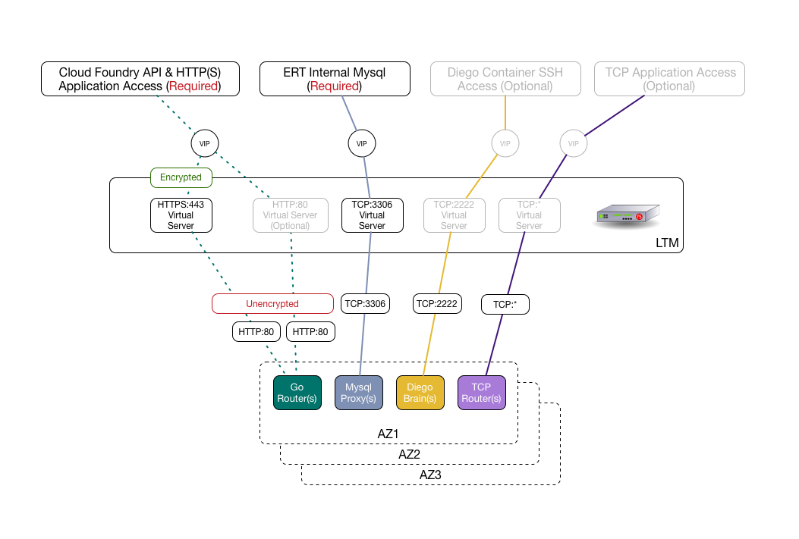
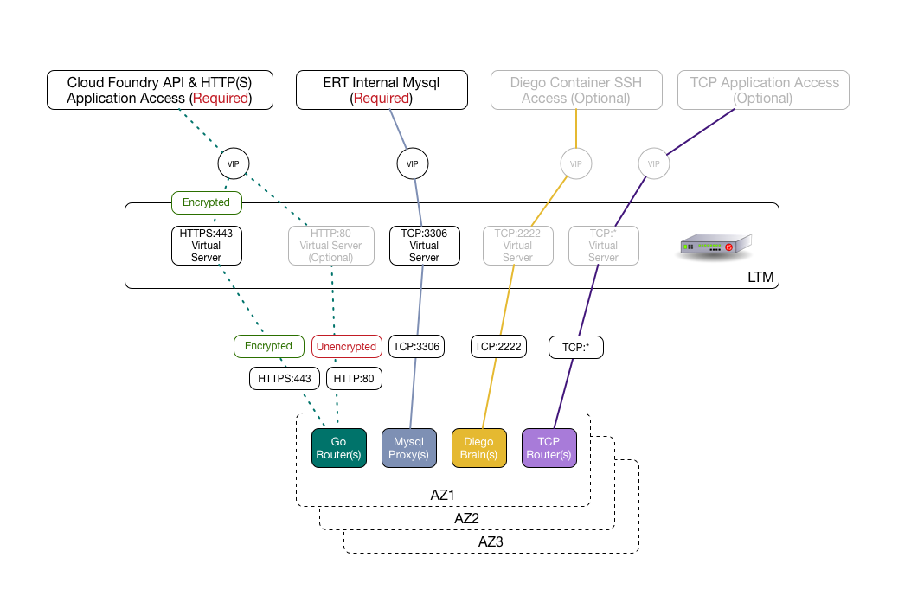

# PCF F5 Cookbook

## Overview

This Cookbook will provide information on how to configure an F5 as an LTM (Local Traffic Manager) for PCF Elastic Runtime.  It assumes the reader is familiar with the following concepts:

- Deploying an F5 physical/virtual Appliance
- Familiar with the F5 UI & F5 `tmsh` (Traffic Management Shell)
- Creating Admin users on the F5
- Creating F5 Self IPs, VLANs, & Routes

For guidance on the above topics,  please visit [F5's knowledge base](https://support.f5.com/csp/knowledge-center/software/BIG-IP?module=BIG-IP%20LTM).

F5 Version Used in this CookBook: `12.1.2` and `13.0.0`

**This cookbook assumes you have a functional F5 deployed. Once you have the F5 deployed follow the steps below**.

## Recipes

### (1) Client terms SSL @ F5 -> F5 forwards Unencrypted HTTP -> GoRouters

#### Summary
__PCF ERT Config option__: *Forward unencrypted traffic to Elastic Runtime Router. Assumes an external load balancer is configured to forward unencrypted traffic*



- HTTP/HTTPS: This config will terminate client SSL at the F5 and then forward standard HTTP traffic to the backend gorouters from the LTM
- TCP:  All TCP backends (mysql, ssh-proxy, TCP routers) will accept forwarded traffic from the LTM.

#### Recipe

In the F5 UI (unless otherwise called out,  accept defaults for fields not referenced) ...

1. Create 3 iRules:

  - Navigate to `Local Traffic -> iRules -> iRule List`
  - Create iRule 1
      - Name: 	`cf-xforward-for`
      - Definition: ```
        when HTTP_REQUEST {
        HTTP::header insert X-Forwarded-For [IP::remote_addr]
        }```
  - Create iRule 2
      - Name: 	`cf-xforward-proto-https`
      - Definition: ```
        when HTTP_REQUEST {
        HTTP::header insert X-Forwarded-Proto "https"
        }```
  - Create iRule 3
      - Name: 	`cf-xforward-proto-http`
      - Definition: ```
        when HTTP_REQUEST {
        HTTP::header insert X-Forwarded-Proto "http"
        }```
2. Import SSL Certificates:

  - Navigate to `System -> File Management -> SSL Certificate List`
  - Import PCF ERT Certificate and name it `pcf-ert-cert`
  - Import PCF ERT Certificate Key and name it `pcf-ert-key`
3. Create 4 Health Monitors:

  - Navigate to `Local Traffic -> Monitors`
  - Create Health Monitor 1 `gorouter`
      - Name: `gorouter_mon`
      - Type: `HTTP`
      - Send String: `GET /health`
      - Alias Service Port: `8080`
  - Create Health Monitor 2 `mysqlproxy`
      - Name: `mysqlproxy_mon`
      - Type: `TCP`
      - Alias Service Port: `1936`
  - Create Health Monitor 3 `sshproxy`
      - Name: `diegobrain_mon`
      - Type: `TCP`
      - Alias Service Port: `2222`
  - Create Health Monitor 4 `tcprouter`
      - Name: `tcprouter_mon`
      - Type: `HTTP`
      - Send String: `GET /health`
      - Alias Service Port: `80`
4. Create All required nodes (Backend Pool Members):

  - Navigate to `Local Traffic -> Nodes -> Node List`
  - Create desired qty of `gorouter` nodes, one for each gorouter in your PCF ERT.
      - Name: `gorouter-#`
      - Address: `[IP ADDRESS OF gorouter]`
      - State: `enabled`
      - Health Monitors: `Node Default`
  - Create desired qty of `mysqlproxy` nodes, one for each mysqlproxy in your PCF ERT.
      - Name: `mysqlproxy-#`
      - Address: `[IP ADDRESS OF mysqlproxy]`
      - State: `enabled`
      - Health Monitors: `Node Default`
  - Create desired qty of `diegobrain` nodes, one for each diegobrain in your PCF ERT.
      - Name: `diegobrain-#`
      - Address: `[IP ADDRESS OF diegobrain]`
      - State: `enabled`
      - Health Monitors: `Node Default`
  - Create desired qty of `tcprouter` nodes, one for each tcprouter in your PCF ERT.
      - Name: `tcprouter-#`
      - Address: `[IP ADDRESS OF tcprouter]`
      - State: `enabled`
      - Health Monitors: `Node Default`

5. Create 4 Member 'Pools':

   - Navigate to `Local Traffic -> Pools`
   - Create `gorouter` pool
      - Name: `gorouter_pool`
      - Health Monitors: `gorouter_mon`
      - Load Balancing Method: `Least Connections`
      - _Add_ all `gorouter-#` nodes
          - Service Port: 80
   - Create `mysqlproxy` pool
      - Name: `mysqlproxy_pool`
      - Health Monitors: `mysqlproxy_mon`
      - Load Balancing Method: `Least Connections`
      - _Add_ all `mysqlproxy-#` nodes
          - Service Port: 3306
   - Create `diegobrain` pool
      - Name: `diegobrain_pool`
      - Health Monitors: `diegobrain_mon`
      - Load Balancing Method: `Least Connections`
      - _Add_ all `diegobrain-#` nodes
          - Service Port: 2222
   - Create `tcprouter` pool
      - Name: `tcprouter_pool`
      - Health Monitors: `tcprouter_mon`
      - Load Balancing Method: `Least Connections`
      - _Add_ all `tcprouter-#` nodes
          - Service Port: */0

6. Create SSL Client Profile:

      - Navigate to `Local Traffic -> Profiles -> SSL -> Client`
      - Create SSL Client Profile
          - Name: `pcf-ssl-client-certs-profile`
          - Parent Profile: `clientssl`
          - Custom: `[TRUE]`
          - Add Certificate Key Chain ...
              - Certificate: Select `pcf-ert-cert`
              - Key: Select `pcf-ert-key`
              - _Your deployment may require additional root or intermediate certs.  They can be selected here.  Additionally, pass phrases for certs may also be entered here._

7. Create 5 (2 Required & 3 Optional) LTM Virtual Servers

      - Navigate to `Local Traffic -> Virtual Servers -> Virtual Server List`

      - Create (Required) Virtual Server 1 for `HTTPS` Access to `Cloud Foundry API & Applications`
          - Name: `pcf-https`
          - Type: `Standard`
          - Source Address: `0.0.0.0/0` _Note:Allowed Connections From_
          - Destination Address/Mask: `[Your PCF VIP]` _Note:  This VIP must be DNS resolvable to your PCF system & default apps domains_
          - Service Port: `443`
          - State: `Enabled`
          - Protocol: `TCP`
          - Protocol Profile(Client): `tcp_lan_optimized`
          - Protocol Profile(Server): `(Use Client Profile)`
          - HTTP Profile: `http`
          - SSL Profile: `pcf-ssl-client-certs-profile`
          - VLAN and Tunnel Traffic: `Enabled on [Your Configured F5 VPN]`
          - Source Address Translation: `Auto Map` _Note: Required to be set in 1 arm configs_
          - Default Pool: `gorouter_pool`
          - iRules: `cf-xforward-for` & `cf-xforward-proto-https`

      - Create (Optional) Virtual Server 2 for `HTTP` Access to `Cloud Foundry Applications`
          - Name: `pcf-http`
          - Type: `Standard`
          - Source Address: `0.0.0.0/0` _Note:Allowed Connections From_
          - Destination Address/Mask: `[Your PCF VIP]` _Note:  This VIP must be DNS resolvable to your PCF default apps domains_
          - Service Port: `80`
          - State: `Enabled`
          - Protocol: `TCP`
          - Protocol Profile(Client): `tcp_lan_optimized`
          - Protocol Profile(Server): `(Use Client Profile)`
          - HTTP Profile: `http`
          - SSL Profile: `[NONE]`
          - VLAN and Tunnel Traffic: `Enabled on [Your Configured F5 VPN]`
          - Source Address Translation: `Auto Map` _Note: Required to be set in 1 arm configs_
          - Default Pool: `gorouter_pool`
          - iRules: `cf-xforward-for` & `cf-xforward-proto-http`

      - Create (Required) Virtual Server 3 for `mysqlproxy`.  This Virtual Server increases internal ERT mysql availability.
          - Name: `pcf-mysqlproxy`
          - Type: `Standard`
          - Source Address: `0.0.0.0/0` _Note:Allowed Connections From_
          - Destination Address/Mask: `[Your Internal Mysql ERT VIP]` _Note:  This VIP must be DNS resolvable to the fqdn entered into your ERT config for 'MySQL Service Hostname_'
          - Service Port: `3306`
          - State: `Enabled`
          - Protocol: `TCP`
          - Protocol Profile(Client): `tcp_lan_optimized`
          - Protocol Profile(Server): `(Use Client Profile)`
          - HTTP Profile: `[NONE]`
          - SSL Profile: `[NONE]`
          - VLAN and Tunnel Traffic: `Enabled on [Your Configured F5 VPN]`
          - Source Address Translation: `Auto Map` _Note: Required to be set in 1 arm configs_
          - Default Pool: `mysqlproxy_pool`

      - Create (Optional) Virtual Server 4 for `sshproxy`.  This Virtual Server allows developers to ssh into Diego containers.
          - Name: `pcf-sshproxy`
          - Type: `Standard`
          - Source Address: `0.0.0.0/0` _Note:Allowed Connections From_
          - Destination Address/Mask: `[Your SSH Proxy VIP]` _Note:  This VIP must be DNS resolvable ssh.[your-pcf-ert-system-domain]_'
          - Service Port: `2222`
          - State: `Enabled`
          - Protocol: `TCP`
          - Protocol Profile(Client): `tcp_lan_optimized`
          - Protocol Profile(Server): `(Use Client Profile)`
          - HTTP Profile: `[NONE]`
          - SSL Profile: `[NONE]`
          - VLAN and Tunnel Traffic: `Enabled on [Your Configured F5 VPN]`
          - Source Address Translation: `Auto Map` _Note: Required to be set in 1 arm configs_
          - Default Pool: `diegobrain_pool`

      - Create (Optional) Virtual Server 5 for `tcprouter`.  This Virtual Server allows access to Cloud Foundry `TCP` applications.
          - Name: `pcf-tcprouter`
          - Type: `Standard`
          - Source Address: `0.0.0.0/0` _Note:Allowed Connections From_
          - Destination Address/Mask: `[Your TCP Router VIP]` _Note:  This VIP must be DNS resolvable tcp.[your-configured-tcp-domain]_'
          - Service Port: `*/0`
          - State: `Enabled`
          - Protocol: `TCP`
          - Protocol Profile(Client): `tcp_lan_optimized`
          - Protocol Profile(Server): `(Use Client Profile)`
          - HTTP Profile: `[NONE]`
          - SSL Profile: `[NONE]`
          - VLAN and Tunnel Traffic: `Enabled on [Your Configured F5 VPN]`
          - Source Address Translation: `Auto Map` _Note: Required to be set in 1 arm configs_
          - Default Pool: `tcprouter_pool`

          **Once you have completed configuration check the Network Map located in Local Traffic Menu. Everything should be Green.**

### (2) Client terms SSL @ F5 -> F5 Re-Encrypts HTTPS -> GoRouters

#### Summary
__PCF ERT Config option__: *Forward SSL to Elastic Runtime Router. Assumes an external load balancer is configured to forward encrypted traffic*



- HTTP/HTTPS: This config will terminate client SSL at the F5 and then Re-Encrypt HTTPS traffic to the backend gorouters from the LTM with an internal SSL cert.
- TCP:  All TCP backends (mysql, ssh-proxy, TCP routers) will accept forwarded traffic from the LTM.

#### Recipe

In the F5 UI (unless otherwise called out,  accept defaults for fields not referenced) ...

- ***MG Notes This config is the same as Recipe 1 , except the HTTPS Virtual Server is configured with a Server SSL profile to re-encrypt back to the GoRouters.  Full recipe Will be added to this doc week of Feb 20***

## F5 SCF (Single Configuration Files)

[SCFs](https://support.f5.com/csp/article/K13408) are single files containing a complete F5 configuration for F5 versions 11.x - 12.x  This section contains sample SCF files for functional reference configs.  Often times,  presenting a reference SCF 'template' to a customer F5 administrator can provide all necessary config information for PCF F5 config.

SCFs can be created by using `tmsh`:

`save /sys config file <SCF_filename> no-passphrase`

SCFs can be edited and used as a template to replicate configurations across multiple F5s by using `tmsh`:

`load /sys config file <SCF_filename>`

### Sample SCFs

[Recipe 1](sample_f5_configs/pcf-f5-recipe1-scf.txt)

## F5 Advanced Config/Topics

- URL Rewrites (Coming Soon)
- Additional PCF Service Tiles (Mysql, Rabbit, etc ...) (Coming Soon)
- Scripting Automated F5 Config via `tmsh` (Coming Soon)
- GSLB Config with F5 LTM & F5 GTM (Coming Much Later :) )

## Additional F5 Resources

[F5 Trial Downloads](https://f5.com/products/trials/product-trials)
[Pivotal Services Legacy iRule Bank Git Repo](https://github.com/pivotalservices/pivotal-cf-irules)
